# Цель работы

Целью работы является изучение идеологии и применения средств контроля версий, приобретение практических навыков по работе с системой контроля версий git.

# Задание

На основе методических указаний провести работу с базовыми командами
системы контроля версий git, выучить применение команд для разных случаев
использования, настроить GitHub.

# Теоретическое введение

Системы контроля версий (Version Control System, VCS)применяются при работе нескольких человек над одним проектом. Обычно основное дерево проекта
хранится в локальном или удалённом репозитории, к которому настроен доступ для участников проекта. При внесении изменений в содержание проекта система контроля версий позволяет их фиксировать, совмещать изменения, произведённые разными участниками проекта, производить откат к любой более ранней версии проекта, если это требуется. В классических системах контроля версий используется централизованная модель, предполагающая наличие единого
репозитория для хранения файлов. Выполнение большинства функций по
управлению версиями осуществляется специальным сервером. Участник проекта(пользователь) перед началом работы посредством определённых команд получает нужную ему версию файлов. После внесения изменений пользователь размещает новую версию в хранилище. При этом предыдущие версии не удаляются из центрального хранилища и к ним можно вернуться в любой момент. Сервер может сохранять не полную версию изменённых файлов, а производить так называемую дельта-компрессию — сохранять только изменения между последовательными
версиями, что позволяет уменьшить объём хранимых данных. Системы контроля версий поддерживают возможность отслеживания и разрешения конфликтов, которые могут возникнуть при работе нескольких человек над одним файлом. Можно объединить (слить) изменения, сделанные разными участниками
(автоматически или вручную), вручную выбрать нужную версию, отменить
изменения вовсе или заблокировать файлы для изменения. В зависимости от
настроек блокировка не позволяет другим пользователям получить рабочую копию или препятствует изменению рабочей копии файла средствами файловой системы ОС, обеспечивая, таким образом, привилегированный доступ только одному пользователю, работающему с файлом. Системы контроля версий также могут обеспечивать дополнительные, более гибкие функциональные возможности.Например, они могут поддерживать работу с несколькими версиями одного файла, сохраняя общую историю изменений до точки ветвления версий и собственные истории изменений каждой ветви. Кроме того, обычно доступна информация о том, кто из участников, когда и какие изменения вносил. Обычно такого рода информация хранится в журнале изменений, доступ к которому можно ограничить. В отличие от классических в распределённых системах контроля версий центральный репозиторий не является обязательным. Среди классических VCS наиболее известны CVS, Subversion, а среди распределённых — Git, Bazaar, Mercurial. Принципы их работы схожи, отличаются они в основном синтаксисом используемых в работе команд. Система
контроля версий Git представляет собой набор программ командной строки. Доступ к ним можно получить из терминала посредством ввода команды git с различными опциями. Благодаря тому, что Git является распределённой системой контроля версий, резервную копию локального хранилища можно сделать простым копированием или архивацией. (рис. -@fig:001)

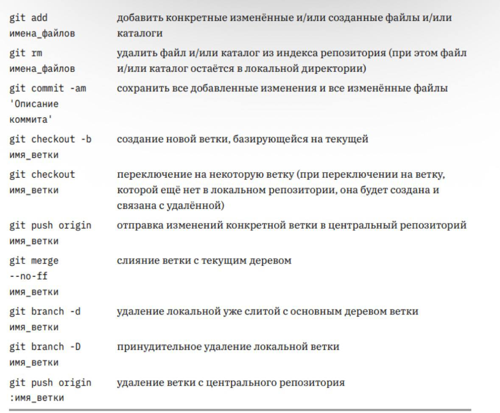{#fig:001 width=70%}

# Выполнение лабораторной работы

## Техническое обеспечение

Лабораторная работа была выполнена в среде виртуальной машины Oracle
VM VirtualBox с установленной операционной системой Fedora Workstation 40,
развернутой на домашнем компьютере под управлением Windows 11.

## Базовая настройка Git

Я начала работу с предварительной конфигурации системы контроля версий
Git. Для этого в терминале были выполнены базовые команды настройки(рис. -@fig:002)

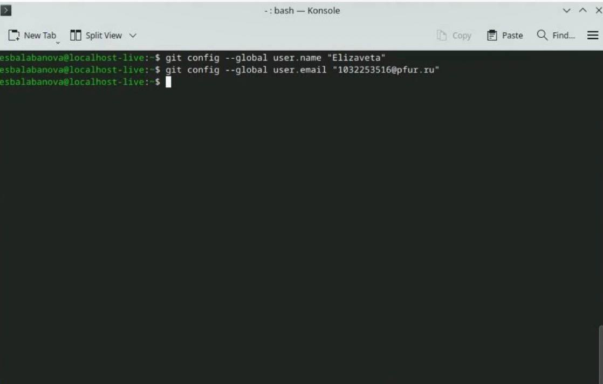{#fig:002 width=70%}

Затем я настроила важные параметры для корректной работы с текстом:
кодировку utf-8, имя начальной ветки, а также параметры autocrlf и safecrlf (рис. -@fig:003)

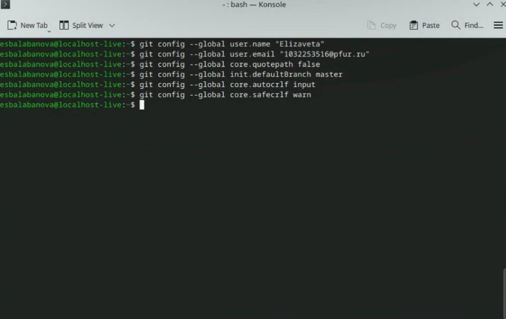{#fig:003 width=70%}

Для безопасного подключения к платформе GitHub я создала пару SSH-
ключей с использованием алгоритма шифрования (рис. -@fig:004)

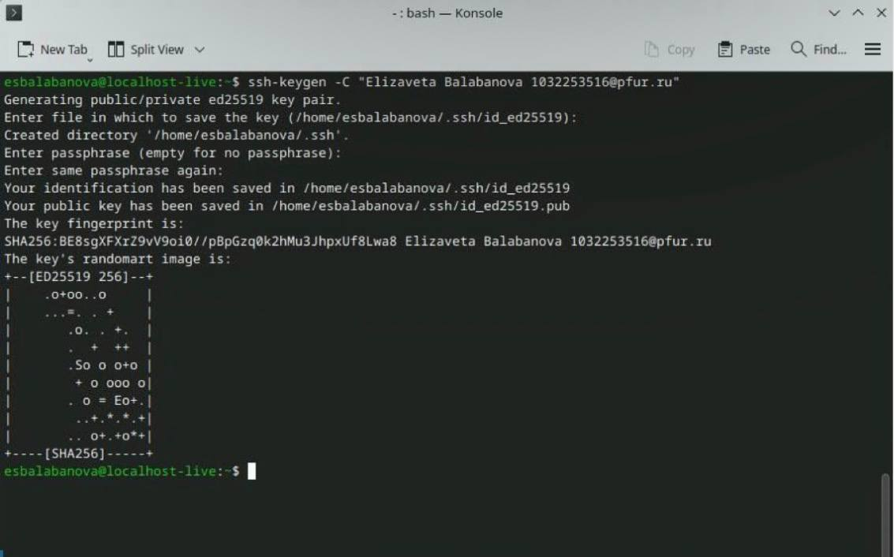{#fig:004 width=70%}

После создания ключей я перешла на сайт GitHub, авторизовалась в своейучетной записи и добавила открытый ключ в соответствующий раздел настроек безопасности.(рис. -@fig:005)

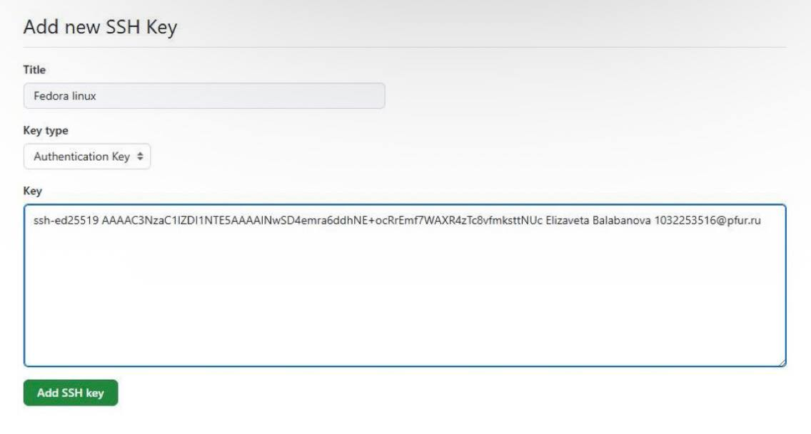{#fig:005 width=70%}

После генерации SSH-ключа в терминале открытый ключ был успешно
добавлен в раздел управления SSH-ключами в профиле GitHub, что подтвердило успешную интеграцию системы аутентификации(рис. -@fig:006)

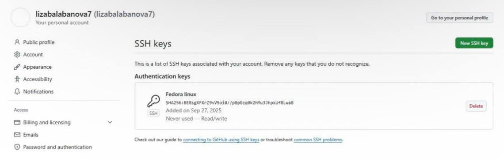{#fig:006 width=70%}

## Создание рабочего пространства и репозитория курса на основе
шаблона

Для организации лабораторных работ мне потребовалось создать
структурированное рабочее пространство с определенной иерархией каталогов. Я создала необходимую директорию на рабочем компьютере (рис. -@fig:007)

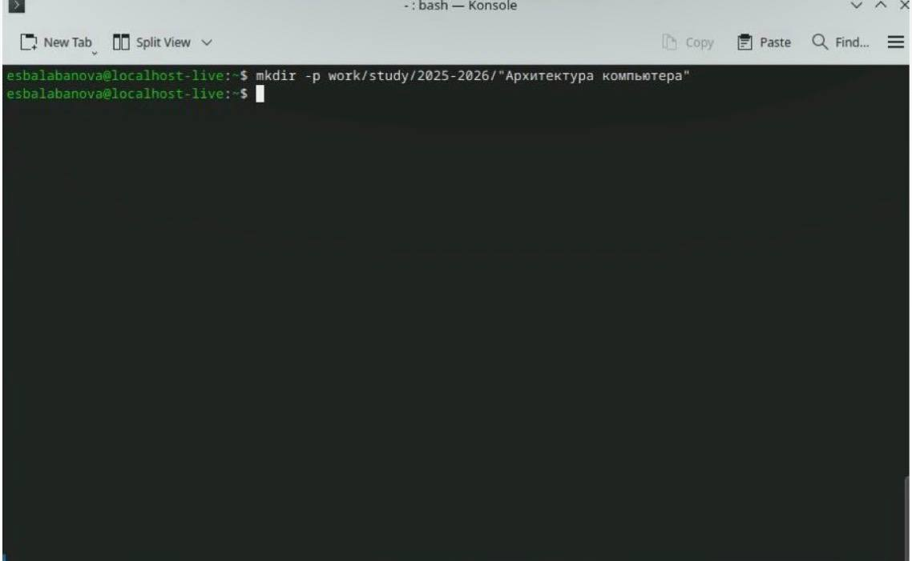{#fig:007 width=70%}
##  Создание репозитория курса на основе шаблона

Я создала учебный репозиторий на основе готового шаблона, используя
функционал клонирования, предоставляемый интерфейсом GitHub. (рис. -@fig:008) (рис. -@fig:009)

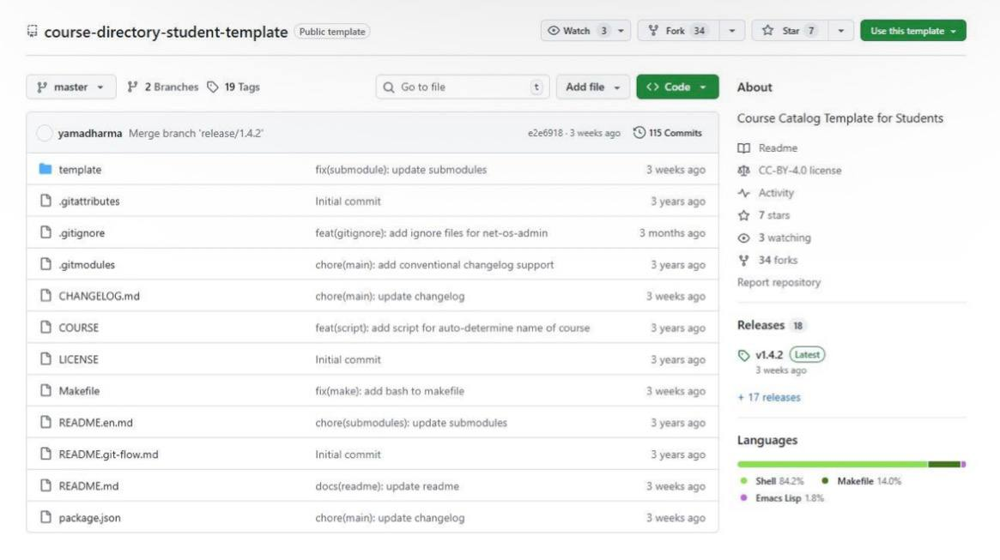{#fig:008 width=70%}

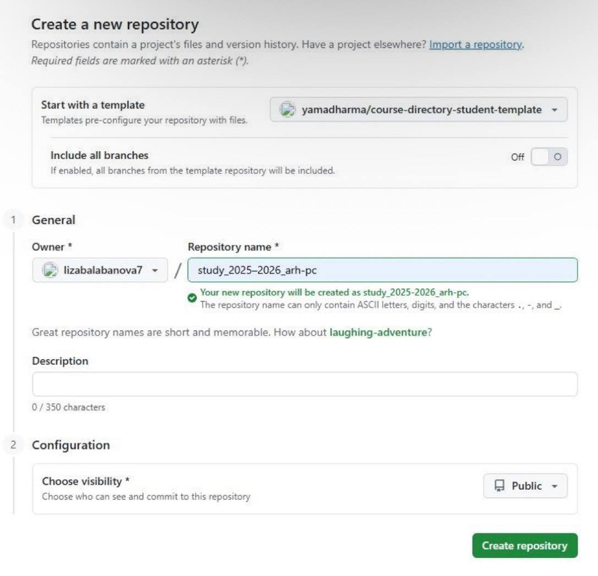{#fig:009 width=70%}

Сгенерированный на основе шаблона репозиторий я склонировала на
рабочий компьютер. Для этого скопировала ссылку для клонирования через веб-интерфейс GitHub (рис. -@fig:010) и выполнила команду git clone в терминале.

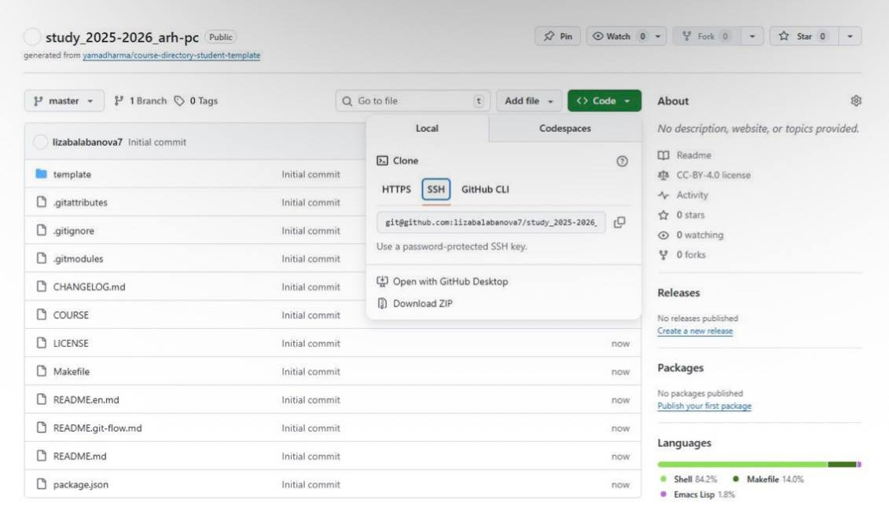{#fig:010 width=70%}

## Настройка каталога курса 

В каталоге курса я удалила ненужные файлы и создала необходимую
структуру папок для организации учебных материалов. (рис. -@fig:011)

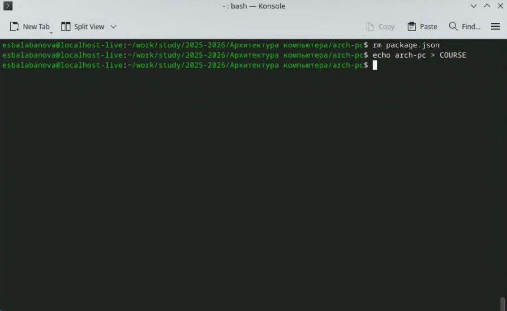{#fig:011 width=70%}

После настройки структуры я зафиксировала внесенные изменения иотправила их в свой репозиторий на GitHub. (рис. -@fig:012)

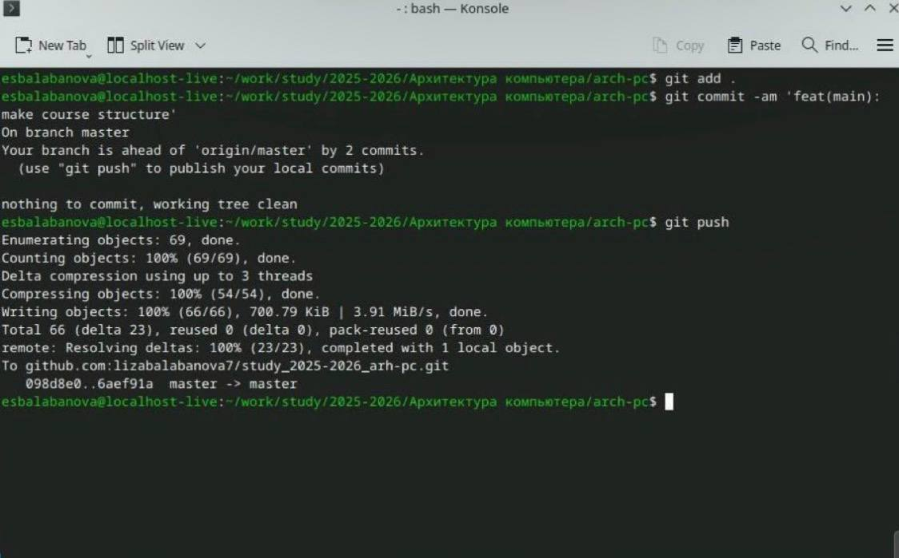{#fig:012 width=70%}

## Задания для самостоятельной работы

# Задание 1

(рис. -@fig:013)

{#fig:013 width=70%}

# Задание 2

(рис. -@fig:014)

{#fig:014 width=70%}

# Задание 3

(рис. -@fig:015)

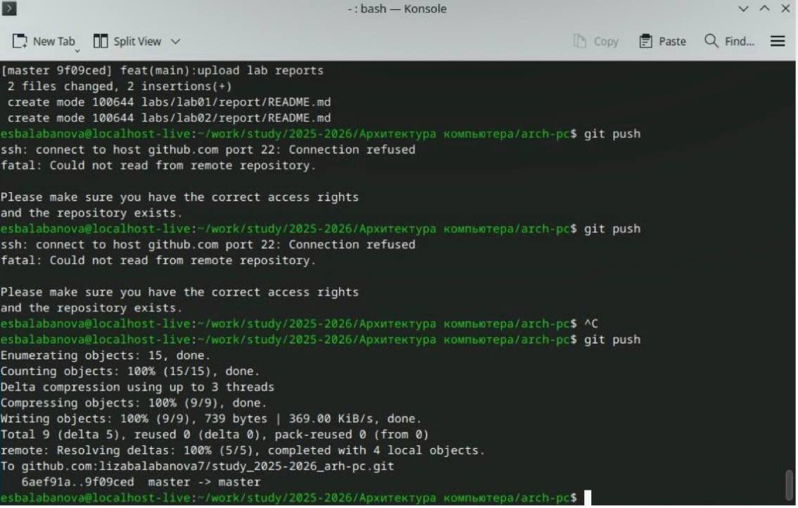{#fig:015 width=70%}

# Выводы

В процессе лабораторной работы я изучила теоретические основы систем
контроля версий и приобрела практические навыки работы с Git. Были освоены принципы управления версиями файлов, работа с локальными и удалёнными репозиториями, а также основные команды для эффективного контроля изменений
в проектах.

# Список литературы

1. https://github.com/lizabalabanova7/study_2025-2026_arh-pc/tree/master
2. https://esystem.rudn.ru/mod/resource/view.php?id=1297701
3. https://esystem.rudn.ru/mod/resource/view.php?id=1030495
4. https://esystem.rudn.ru/mod/page/view.php?id=1030492
5. https://esystem.rudn.ru/mod/resource/view.php?id=1030496