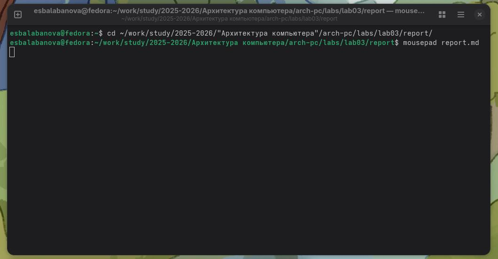

# Цель работы

Целью данной лабораторной работы является освоение процедуры оформления отчетов с помощью легковесного языка разметки Markdown.

# Задание
* Установка необходимого ПО
* Оформление отчета по лабораторной работе №3 с применением языка разметки Markdown
* Задание для самостоятельного выполнения

# Теоретическое введение

Markdown — облегчённый язык разметки, созданный с целью обозначения форматирования в простом тексте, с максимальным сохранением его читаемости человеком, и пригодный для машинного преобразования в языки для продвинутых публикаций (HTML, Rich Text и других). 
Язык разметки Markdown предоставляет интуитивно понятные средства для форматирования текстовых документов. Для создания заголовков различного уровня используются символы решётки: от # для заголовка первого уровня до ####для заголовка четвертого уровня.
Форматирование текста осуществляется с помощью специальных символов: заключение текста в двойные звёздочки ** придает ему полужирное начертание, а в одинарные * — курсивное. Для создания цитат применяется символ >, что позволяет визуально выделить блоки заимствованного текста.
Markdown поддерживает различные типы списков. Упорядоченные списки форматируются с помощью цифр, а неупорядоченные — с использованием звёздочек или тире. Вложение списков друг в друга достигается добавлением отступа для элементов дочернего списка.
Важной особенностью языка является возможность включения сложных элементов: гиперссылок, фрагментов кода и математических формул. Синтаксис для встроенных ссылок состоит из текста гиперссылки в квадратных скобках и адреса в круглых. Для оформления формул используется синтаксис, аналогичный LaTeX, как для внутритекстовых, так и для выключенных уравнений.
Огражденные блоки кода позволяют удобно выделять синтаксис программных фрагментов. Общий формат таких блоков предполагает указание языка программирования и размещение кода между тройными апострофами.

# Выполнение лабораторной работы

## Компиляция шаблонов отчета

Предварительно устанавливаю необзодимое ПО: Quarto v1.7.34, Tex Live последней версии. Затем перехожу в корневую директорию учебного курса и синхронизирую локальный репозиторий с удалённым хранилищем на GitHub, используя команду git pull(рис. -@fig:001)

{#fig:001 width=70%}

Запускаю процесс компиляции шаблона отчёта с помощью команды make, которая автоматически генерирует выходные файлы (рис. -@fig:002)

{#fig:002 width=70%}

Проверяю результат выполнения команды, убеждаясь в наличии сгенерированных файлов отчёта с помощью команды ls. (рис. -@fig:003)

{#fig:003 width=70%}

После успешной проверки работы системы компиляции удаляю созданные файлы отчёта командой make clean(рис. -@fig:004)

{#fig:004 width=70%}

С помощью редактора выполняю отчет по выполненной лабораторной работе(рис. -@fig:005)

{#fig:005 width=70%}

## Задания для самостоятельной работы

Аналогично процедуре оформления отчёта по третьей лабораторной работе, выполняю документирование результатов второй лабораторной работы. Для этого перехожу в соответствующую директорию и создаю текстовый отчёт с использованием редактора Mousepad, применяя синтаксис Markdown для форматирования. 

{#fig:006 width=70%}

# Выводы

В процессе выполнения этой лабораторной работы я научилась грамотно оформлять техническую документацию, применяя простой и эффективный язык разметки Markdown.

# Список литературы

1. https://github.com/esbalabanova/study_2025-2026_arh-pc/tree/master
2. https://esystem.rudn.ru/mod/resource/view.php?id=1297702
3. https://esystem.rudn.ru/mod/resource/view.php?id=1030495
4. https://esystem.rudn.ru/mod/page/view.php?id=1030492
5. https://esystem.rudn.ru/mod/resource/view.php?id=1030496
